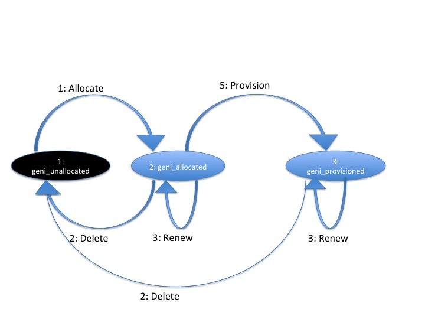

== Basic AM Call Concepts

=== XML-RPC over HTTPS with Client Authentication

***********************************
Overview:
[horizontal]
Layer:: API calls
Layer:: XML-RPC
Layer:: HTTP
  Encrypted by;; SSL with client authentication
Layer:: TCP
***********************************

The AM API is provided via XML-RPC over an SSL connection.
Aggregate Managers shall require client side certificates to authenticate users, accepting only certificates that comply with the adopted GENI certificates standards. This API therefore assumes that users have already been authenticated, and that the aggregate manager has available the client certificate to identify the user. 

NOTE: *TODO: This could use more details, but perhaps they belong in the link:general.html[General] document?*

NOTE: *TODO* add http://groups.geni.net/geni/wiki/GeniApiCertificates here? (or in general document?)

[[ReturnStructure]]
=== Return Structure

.Reply Syntax
[source]
------------------
{
    "code" : {
              ":code" : <int: result code of call>
            },
    (optional on error) "value" : <struct, string, array or int: result of call>
    (optional on success) "output" : <string: error output of call>,
}
------------------

All AM API methods return a +struct+, with at least three members. +code+, +value+, and +output+ together provide the standard return from all AM API methods.

+code+::
+
--
***********************************
Mandatory:: true
XML-RPC type::
[source]
      "code" : {
           ":code" : <int>,
           (optional) ":am_type" : <string>,
           (optional) ":am_code" : <int>
      }
***********************************

A struct indicating the success or failure of this call at the Aggregate Manager. It consists of 1 required field and 2 optional fields.

Elements in code:

   +:code+;;
An integer supplying the GENI standard return code indicating the success or failure of this call. Error codes are standardized and defined in the <<ErrorCodes, Error Codes section>>. Codes may be negative. A success return is defined as +:code+ of 0. 
+
Aggregates shall return consistent values for +:code+ as described [[ErrorCodes, in this section]]. Aggregates wishing to be more specific may use the +:am_type+ and +:am_code+ values.
   
   +:am_type+;;
Optional. A (case insensitive) string indicating the type of Aggregate Manager running locally. For example, orca. When an aggregate wants to return an aggregate specific return code in the +:am_code+ field, they supply an +:am_type+ to qualify the kind of aggregate specific return code they are supplying. This is the namespace of the aggregate specific return code. This field is optional: aggregates are not required to supply an aggregate specific return code, and clients need not look at it. This code further qualifies the kind of error or success that the aggregate is returning, as primarily defined by the value of +:code+. Standard values for +:am_type+ are defined link:http://groups.geni.net/geni/attachment/wiki/GAPI_AM_API_V3/CommonConcepts/geni-am-types.xml[here]. *TODO should this be a link or be included directly in the document? Should we make the linked document part of this API?*
   
   +:am_code+;;
Optional. An integer supplying the more specific return code, relative to the aggregate type specified in +:am_type+. This integer may be negative. Aggregates should document these codes publicly. This API does not specify how or where that documentation should be provided. 
--

+value+::
+
***********************************
Mandatory:: On success only. Optional on error.
XML-RPC type:: Depends on specific call.
***********************************
+
The return value of a successful call can be found here.

+output+::
+
--
***********************************
Mandatory:: On error only. Optional on success.
XML-RPC type:: +string+
***********************************

This is an XML-RPC string with a human readable message explaining the result. Specifically, this might include an error string, a stacktrace, or other useful messages to help the experimenter resolve or report the failure or error. It is not defined on success, though aggregates are free to use it. 
--

Aggregates are encouraged to use code values and output messages that help experimenters and tools distinguish between bad input, other experimenter error, temporary server errors, or server bugs.

Implementations can add additional members to the return struct as desired. All of these additional members must have a prefix followed by a colon. Implementations should choose an appropriate prefix to avoid conflicts. The empty prefix (+:+ a single colon with nothing in front of it) is reserved by this API specification (and future version of it). Aggregates should document their additional return members.

[[ErrorCodes]]
==== Error Codes

Success is always indicated using a +:code+ value of 0.  On one of the error or failure cases listed in the table below, aggregates shall return the indicated error code.

/////////////////////////////////
GENI standard error codes are documented in the link:http://groups.geni.net/geni/attachment/wiki/GAPI_AM_API_V3/CommonConcepts/geni-error-codes.xml[attached XML document], and listed below.
|=======
| 0  |  SUCCESS      | "Success"
| 1  |  BADARGS      | "Bad Arguments: malformed arguments"
| 2  |  ERROR    | "Error (other)"
| 3  |  FORBIDDEN    | "Operation Forbidden: eg supplied credentials do not provide sufficient privileges (on given slice)"
| 4  |  BADVERSION   | "Bad Version (eg of RSpec)"
| 5  |  SERVERERROR      | "Server Error"
| 6  |  TOOBIG   | "Too Big (eg request RSpec)"
| 7  |  REFUSED      | "Operation Refused"
| 8  |  TIMEDOUT     | "Operation Timed Out"
| 9  |  DBERROR      | "Database Error"
| 10 |  RPCERROR     | "RPC Error"
| 11 |  UNAVAILABLE      | "Unavailable (eg server in lockdown)"
| 12 |  SEARCHFAILED     | "Search Failed (eg for slice)"
| 13 |  UNSUPPORTED      | "Operation Unsupported"
| 14 |  BUSY     | "Busy (resource, slice); try again later"
| 15 |  EXPIRED      | "Expired (eg slice)"
| 16 |  INPROGRESS   | "In Progress"
| 17 |  ALREADYEXISTS    | "Already Exists (eg the slice}"
| 24 |  VLAN_UNAVAILABLE     | "VLAN tag(s) requested not available (likely stitching failure)"
| 25 |  INSUFFICIENT_BANDWIDTH   | "Requested capacity for link(s) not available"
|=======
/////////////////////////////////

Aggregates are to provide hints on how to fix bad requests using the value entry to experimenters on error or failures. For example, a failed <<Renew>> call that failed because you are not allowed to renew your sliver that far in the future, might return a new date string in the value field that would be allowed. Similarly, a failed <<Allocate>> call might return a modified request RSpec in the value field.

Note that a malformed XML-RPC request should still raise an XML-RPC Fault, and other Faults dictated by the XML-RPC specification should still be raised. Aggregates should avoid raising an error (XML-RPC Fault) for application layer errors or any other cases where the XML-RPC specification does not require a Fault, but rather should attempt to return this struct, providing any error messages and stack traces in the output field or other additional fields. Certain XML-RPC errors may be returned using Faults or otherwise by the XML-RPC layer, or may more properly be returned using this struct in the application layer. In such cases, servers should use error codes with negative values. Selected such errors are listed below:

SERVERBUSY::
[horizontal]
   Error Nr;; -32001
   Calls;; all
   Meaning;; Server is (temporarily) too busy; try again later

Note also that servers may respond with other HTTP error codes, and clients must be prepared to deal with those situations. Specifically, a server that is busy might return HTTP code 503, or just refuse the connection. 

[NOTE]
=====================================================================
*TODO* 

- The differences between errors should be made as clear as possible.
- The layout below might need some work (a table isn't very nice either)
- Add some examples. These can be the same as examples later on in the document (but the corresponding example below will only include the date in the +value+ field).
- Also add an example in full "raw" xml, matching one of the other examples.
=====================================================================

Detailed description of each error.

SUCCESS::
[horizontal]
   Error Nr;; 0
   Calls;; all
   Meaning;; Not an error: the call was successful. A return can be found in the +value+ field. 
BADARGS:: 
[horizontal]
   Error Nr;; 1
   Calls;; all
   Meaning;; One of the required arguments is badly formed or missing
ERROR::  
[horizontal]
   Error Nr;; 2
   Calls;; all
   Meaning;; Internal error
FORBIDDEN::
[horizontal]
   Error Nr;; 3
   Calls;; all except <<GetVersion>>
   Related Argument;; credentials 
   Meaning;; Operation Forbidden: eg supplied credentials do not provide sufficient privileges (on given slice)
BADVERSION::
[horizontal]
   Error Nr;; 4
   Calls;; <<ListResources>>, <<Provision>>, <<Describe>> 
   Related Argument;; rspec_version
   Meaning;; Bad Version (eg of RSpec) 
SERVERERROR::  
[horizontal]
   Error Nr;; 5
   Calls;; all
   Meaning;; Server error
TOOBIG::
[horizontal]
   Error Nr;; 6
   Calls;; <<Allocate>> 
   Related Argument;; rspec
   Meaning;; Too Big (eg request RSpec)
REFUSED::
[horizontal]
   Error Nr;; 7
   Calls;; ?
   Meaning;; Operation Refused
TIMEDOUT::
[horizontal]
   Error Nr;; 8
   Calls;; ?
   Meaning;; Operation Timed Out
DBERROR::
[horizontal]
   Error Nr;; 9
   Calls;; ?
   Meaning;; Database Error
RPCERROR::
[horizontal]
   Error Nr;; 10
   Calls;; ?
   Meaning;; RPC Error
UNAVAILABLE::  
[horizontal]
   Error Nr;; 11
   Calls;; all
   Meaning;; Unavailable (eg server in lockdown)
SEARCHFAILED::
[horizontal]
   Error Nr;; 12
   Calls;; ?
   Related Argument;; urns 
   Meaning;; Search Failed (eg for slice)
UNSUPPORTED::
[horizontal]
   Error Nr;; 13
   Calls;; ?
   Related Argument;; urns 
   Meaning;; Operation Unsupported
BUSY::
[horizontal]
   Error Nr;; 14
   Calls;; ?
   Related Argument;; urns 
   Meaning;; Busy (resource, slice); try again later
EXPIRED::
[horizontal]
   Error Nr;; 15
   Calls;; ?
   Related Argument;; urns 
   Meaning;; Expired (eg slice)
INPROGRESS::
[horizontal]
   Error Nr;; 16
   Calls;; ?
   Meaning;; In Progress
ALREADYEXISTS::
[horizontal]
   Error Nr;; 17
   Calls;; ?
   Meaning;; Already Exists (eg the slice}
VLAN_UNAVAILABLE::
[horizontal]
   Error Nr;; 24
   Calls;; ?
   Meaning;; VLAN tag(s) requested not available (likely stitching failure)
INSUFFICIENT_BANDWIDTH::
[horizontal]
   Error Nr;; 25
   Calls;; ?
   Meaning;; Requested capacity for link(s) not available

[[OperationsOnIndividualSlivers]]
=== Operations on Individual Slivers

A Sliver is an aggregate defined grouping of resources within a slice at this aggregate, whose URN identifies the sliver, and can be used as an argument to methods such as <<Delete>> or <<Renew>>, and whose status can be independently reported in the return from <<Status>>. The AM defines 1 or more of these groupings to satisfy a given resource request for a slice. All reserved resources are directly contained by exactly 1 such sliver container, which is in precisely 1 slice.

One or more slivers are created by an aggregate when the experimenter tool calls <<Allocate>>. This API encourages aggregates to independently manage each sliver, allowing experimenters to selectively <<Delete>>, <<Renew>>, or <<Provision>> each sliver. As such, these methods take a list of sliver urns (or a slice urn), and return a struct reporting results for each sliver URN independently. However, slivers at an aggregate may have interdependencies, and an individual aggregate may not be able to independently manage each sliver, without also modifying other related slivers. This API defines a number of aggregate configuration options returned by <<GetVersion>>, and an option to many methods, allowing aggregates to advertise their behavior, and experimenters to request particular behavior.

+:single_allocation+:: 
+
***********************************
Mandatory:: false
XML-RPC type:: +boolean+
Default:: false
***********************************
+
When true (not default), and performing one of (<<Describe>>, <<Allocate>>, <<Renew>>, <<Provision>>, <<Delete>>), such an AM requires you to include either the slice urn or the urn of all the slivers in the same state. If you attempt to run one of those operations on just some slivers in a given state, such an AM will return an error (UNSUPPORTED.
+
For example, at an AM where +:single_allocation+ is true you must <<Provision>> all +:allocated+ slivers at once. If you supply a list of sliver URNs to <<Provision>> that is only 'some' of the +:allocated+ slivers for this slice at this AM, then the AM will return an error. Similarly, such an aggregate would return an error from <<Describe>> if you request a set of sliver URNs that is only some of the +:provisioned+ slivers.

+:allocate+:: 
+
***********************************
Mandatory:: false
XML-RPC type:: +string+ (case insensitive)
Default:: +:single+
Allowed values:: +:single+, +:disjoint+, +:many+
***********************************
+
A case insensitive string, one of fixed set of possible values. Default is +:single+. This option defines whether this AM allows adding slivers to slices at an AM (i.e. calling <<Allocate>> multiple times, without first deleting the allocated slivers). Possible values:

        +:single+;; Performing multiple Allocates without a delete is an error condition (error code UNSUPPORTED) because the aggregate only supports a single sliver per slice or does not allow incrementally adding new slivers. This is the AM API v2 behavior.
        +:disjoint+;; Additional calls to <<Allocate>> must be disjoint from slivers allocated with previous calls (no references or dependencies on existing slivers). The topologies must be disjoint in that there can be no connection or other reference from one topology to the other. Allocate must return the UNSUPPORTED error code when this condition is not met.
        +:many+;; Multiple slivers can exist and be incrementally added, including those which connect or overlap in some way. New aggregates should strive for this capability. 

Many methods also take a +:best_effort+ option (aggregates must support it, clients do not need to supply it):

+:best_effort+::
+
***********************************
[horizontal]
Name:: +:best_effort+
Calls:: <<Provision>>, <<PerformOperationalAction>>, <<Status>>, <<Renew>>, <<Delete>>
Supported by the server:: Mandatory
Included by client:: Optional 
XML-RPC type:: +boolean+
Default:: +false+
***********************************
+
See also <<CommonOptionBestEffort, +:best_effort+ option>>
+
If false (default), the client is requesting that the aggregate either fully satisfy the request, moving all listed slivers to the desired state, or fully fail the request, leaving all slivers in their original state and returning an appropriate error code. If the aggregate cannot guarantee all or nothing success or failure given the included slivers and resource types, the aggregate shall fail the request, returning an appropriate error code (UNSUPPORTED).  If this option is true, then some slivers may transition to the new state, and some not. Experimenters must examine the return closely to know the state of their slivers - such methods will return data about all requested slivers. Aggregates may optionally return +:error+ for each sliver for which the operation failed, to indicate further details. Note that <<Allocate>> is always all-or-nothing.

It is expected that many aggregates will implement one of the following combinations of options:

- Accept requests for +:best_effort+ = true, and advertise +:allocate+ = +:many,+ +:single_allocation+ = false (E.G. FOAM, PlanetLab).
- Operate as though all requests were +:best_effort+ = false, and advertise +:allocate+ = +:disjoint,+ +:single_allocation+ = true (E.G. ProtoGENI). 

=== Sliver Allocation States

Many operations in this API create slivers or change the allocation status of slivers, and often return the current allocation status of each sliver.

Valid sliver allocation states are:

+:unallocated+:: (also known as 'null'). The sliver does not exist. This is the small black circle in typical state diagrams.
+:allocated+:: (also known as called 'offered' or 'promised'). The sliver exists, defines particular resources, and is in a slice. The aggregate has not (if possible) done any time consuming or expensive work to instantiate the resources, provision them, or make it difficult to revert the slice to the state prior to allocating this sliver. This state is what the aggregate is offering the experimenter.
+:provisioned.+:: The aggregate has started instantiating resources, and otherwise making changes to resources and the slice to make the resources available to the experimenter. At this point, operational states are valid to specify further when the resources are available for experimenter use. 

.Sliver Allocation States and AM API Method Transitions

+:allocated+ represents resources that have been allocated to a slice without provisioning the resources. This represents a cheap and reversible resource allocation. When a sliver is created and moved into state 2 (+:allocated),+ the aggregate produces a manifest RSpec identifying which resources are included in the sliver. These resources are exclusively available to the containing sliver, but are not ready for use. In particular, allocating a sliver should be a cheap and quick operation, which the aggregate can readily undo without impacting the state of slivers which are fully provisioned. For some aggregates, transitioning to this state may be a no-op.

States 2 and 3 (+:allocated+ and +:provisioned)+ have aggregate and possibly resource specific timeouts. By convention the +:allocated+ state timeout is typically short, to keep most resources available. The +:provisioned+ state timeout is the sliver expiration. If the client does not request transition the sliver from +:allocated+ to +:provisioned+ before the end of the +:allocated+ state timeout, the sliver reverts to +:unallocated+. If the experimenter needs more time, the experimenter should be allowed to request a renewal of either timeout. Note that typically the sliver expiration time (timeout for state 3, +:provisioned)+ will be notably longer than the timeout for state 2, +:allocated.+

State 3, +:provisioned,+ is the state of the sliver allocation after the aggregate begins to instantiate the sliver. Note that fully provisioning a sliver may take noticeable time. This state also includes a timeout - the sliver expiration time. This is the time a resource stays provisioned, and is unrelated to the time it takes to provision a resource. After the sliver expiration timeout, the resource automatically reverts to the +:unallocated+ state (stopping resources when needed). <<Renew>> extends this timeout. For some aggregates and resource types, moving to this state from state 2 (+:allocated)+ may be a no-op.

If the transition from one state to another fails, the sliver shall remain in its original state.

Several AM API methods can be described in terms of transitions among allocation states.

- <<Allocate>> moves 1 or more slivers from +:unallocated+ (state 1) to +:allocated+ (state 2). This method can be described as creating an instance of the state machine for each sliver. If the aggregate cannot fully satisfy the request, the whole request fails. This is a change from the AM API V2 CreateSliver, which also provisioned the resources, and 'started' them. That is <<Allocate>> does one of the three things that CreateSliver did previously.
- <<Delete>> moves 1 or more slivers from either state 2 or 3 (+:allocated+ or +:provisioned),+ back to state 1 (+:unallocated).+ This is similar to the AM API AM API V2 DeleteSliver.
- <<Renew>>, when given slivers in state 2 (+:allocated+ state), requests an extended timeout.
- <<Renew>>, when given slivers in state 3 (+:provisioned+ state) will request and extended sliver expiration timeout. That is, this method's semantics can be the same as RenewSliver from AM API v2.
- <<Provision>> moves 1 or more slivers from state 2 (+:allocated)+ to state 3 (+:provisioned).+ This is some of what AM API V2 CreateSliver did. Note however that this does not 'start' the resources, or otherwise change their operational state (<<PerformOperationalAction>> does that). This method only fully instantiates the resources in the slice. This may be a no-op for some aggregates or resources. 

When <<Provision>> fails for only some slivers, and +:best_effort+ option was supplied, the aggregate will return the status of each requested sliver individually. The +:allocation_state+ for slivers that failed will remain +:allocated.+ This typically suggests that the experimenter may retry the call. For some aggregates or resource types, the sliver may be 'dead', and <<Provision>> may never succeed. Experimenters should check +:error+ for more information.

These states apply to each sliver individually. Logically, the state transition methods then take a single sliver URN. For convenience, these methods accept a list of sliver URNs, or a slice URN as a simple alias for all slivers in this slice at this aggregate.

[[SliverOperationalStates]]
=== Sliver Operational States

Slivers, once fully allocated, are said to be in a particular operational state. States may indicate that a sliver is configuring, running, ready, turning, etc. These states are used by tools to know what sliver-internal actions are relevant, and what aggregate-defined operational actions may be valid.

The AM API defines a few operational states with particular semantics. AMs are not required to support the API defined states for all resources, but if the aggregate uses the API defined states, then the aggregate must follow the given semantics. AMs are however STRONGLY encouraged to support them, to provide maximum interoperability. There is one state that AMs are required to support, +:pending_allocation,+ for a sliver which has not been fully allocated and provisioned (other operational states are not yet valid). Operational states are generally only valid for slivers which have been provisioned (+:provisioned+ allocation state).

AMs may have their own operational states/state-machine internally. AMs are however required to advertise such states and actions that experimenters may see or use, by using an advertisement RSpec extension (if an AM does not advertise operational states, then tools can not know whether any actions are available). See link:rspec.html[the Rspec document] for more information on this extension. Operational states which the experimenter never sees, need not be advertised. Operational states and actions are generally by resource type. The standard RSpec extension attaches such definitions to the sliver_type element of RSpecs.
Operational states defined by AMs must have names with a restricted format. They may only use alphanumeric characters plus underscore, and the first character must be an alphanumeric character. This means they must match the following regular expression: `'^[a-zA-Z0-9][a-zA-Z0-9_]*$'`

The standard advertisement RSpec extension for advertising operational states and actions can be found link:http://www.geni.net/resources/rspec/ext/opstate/1[here], with an example with comments https://www.protogeni.net/trac/protogeni/wiki/RspecAdOpState[here].

States should be defined in terms of

- whether the resource is accessible to the experimenter (on either the data or control planes),
- whether an experimenter action is required to change from this state, and if so,
- what action or actions are useful. If the resource will change states without explicit experimenter action, what is the expected next state on success. 

Note that states represent the AM's view of the operational condition of the resource. Each state represents what the AM has done or learned about the resource, but experimenter actions may cause failures that the AM does not know about. For example, the AM may advertise a state of +:ready+ for a machine when the experimenter has manually rebooted the machine.

There is no generic busy state. Instead, AMs are encouraged to define separate similar transition states for each separate transition path, allowing experimenters to distinguish the start and end states for this transition.

<<Shutdown>> is not an operational state for a sliver. The <<Shutdown>>() API method applies to an entire slice.

States are generally of one of two forms:

- 'wait' states: The AM will change the sliver, causing its operational state to change, without experimenter action.
- 'final' states: The sliver will remain in this state, until and unless the experimenter invokes an operational action on the sliver. 

Some AMs may allow actions during 'wait' states, (e.g. 'Cancel').

Operational actions immediately change the sliver operational state (if any change will occur). Long running actions therefore require a 'wait' state, while the action is completing.

GENI defined operational states (both required and optional for aggregates):

+:pending_allocation+:: Required for aggregates to support. A wait state. The sliver is still being allocated and provisioned, and other operational states are not yet valid. <<PerformOperationalAction>> may not yet be called on this sliver. For example, the sliver is in allocation state +:provisioned,+ but has not been fully provisioned (e.g., the VM has not been fully imaged). Once the sliver has been fully allocated, the AM will transition the sliver to some other valid operational state, as specified by the advertised operational state machine. This state is generally not part of the AM's advertised state machine, as it represents 'operational states not valid yet'. Common next states (and first states of operational state machines) are +:notready,+ +:ready,+ and +:failed.+
+:notready+:: A final state. The resource is not usable / accessible by the experimenter, and requires explicit experimenter action before it is usable/accessible by the experimenter. For some resources, +:start+ will move the resource out of this state and towards +:ready.+
+:configuring+: A wait state. The resource is in process of changing to +:ready+, and on success will do so without additional experimenter action. For example, the resource may be powering on.
+:stopping+:: A wait state. The resource is in process of changing to +:notready+, and on success will do so without additional experimenter action. For example, the resource may be powering off.
+:ready+:: A final state. The resource is usable/accessible by the experimenter, and ready for slice operations.
+:ready_busy+:: A wait state. The resource is performing some operational action, but remains accessible/usable by the experimenter. Upon completion of the action, the resource will return to +:ready.+
+:failed+:: A final state. Some operational action failed, rendering the resource unusable. An administrator action, undefined by this API, may be required to return the resource to another operational state. 
+:updating_users+:: A wait state, related to the optional +:update_users+ action. The resource is in process of modifying user date. Upon completion of the action, the resource will return to +:ready.+ Note that this is an optional state, so so aggregates supporting this state need to advertise this fact in their advertisement RSpec.

Some AM cannot know if a resource is ready or has stopped, or even in which state a resource is. To express this, additional states are available. Clients need to be able to handle these cases.

+:configuring_or_ready+:: A final state. The resource is in process of getting ready and on success will do so without additional experimenter action. Or, the resource is already ready. The resource will stay in this state, and won't got in +:ready+ state ever. This is used if the AM start the resources, but can never know when this operation finishes. It is possible that the AM will however be informed when the resource fails to become ready (but it might also be impossible for the AM to know this).
+:stopping_or_stopped+:: A final state. The resource is in process of stopping (becomming not ready) and on success will do so without additional experimenter action. Or, the resource is already stopped. The resource will stay in this state, and won't got in +:notready+ state ever. This is used if the AM can stop resources, but can never know when this operation finishes.
+:unknown+:: A final state. It is unknown in which state the resource is.
+:unknown_changing+:: A wait state. It is unknown in which state the resource is, but is is changing from one state to another. This state is used if it is known to the AM that the resource will eventually change into a final state (even if that state is unknown). 

[[SliverOperationalActions]]
=== Sliver Operational Actions

NOTE: *TODO this section was copied from the AMv3 spec with only minor changes (mostly markup). This sections content might still be moved to better places.*

Operational actions are commands that the aggregate exposes, allowing an experimenter tool to modify or act on a sliver from outside of the sliver (i.e. without logging in to a machine), without modifying the sliver reservation. Actions may cause changes to sliver operational state.

The API defines a few operational actions: these need not be supported. AMs are encouraged to support these if possible, but only if they can be supported following the defined semantics.

AMs may have their own operational states/state-machine internally. AMs are however required to advertise such states and actions that experimenters may see or use, by using an advertisement RSpec extension (if an AM does not advertise operational states, then tools can not know whether any actions are available). Operational states which the experimenter never sees, need not be advertised. Operational states and actions are generally by resource type. The standard RSpec extension attaches such definitions to the sliver_type element of RSpecs.

The standard advertisement RSpec extension for advertising operational states and actions can be found here, with an example with comments  here.

Tools must use the operational states and actions advertisement to determine what operational actions to offer to experimenters, and what actions to perform for the experimenter. Tools may choose to offer actions which the tool itself does not understand, relying on the experimenter to understand the meaning of the new action.

Any operational action may fail. When this happens, the API method should return an error code. The sliver may remain in the original state. In some cases, the sliver may transition to the +:failed+ state.

Operational actions immediately change the sliver operational state (if any change will occur). Long running actions therefore require a 'wait' state, while the action is completing.

Defined operational actions:

+:start+:: This action results in the sliver becoming +:ready+ eventually. The operation may fail (move to +:failed),+ or move through some number of transition states. For example, booting a VM.
+:restart+:: This action results in the sliver becoming +:ready+ eventually. The operation may fail (move to +:failed),+ or move through some number of transition states. During this operation, the resource may or may not remain accessible. Dynamic state associated with this resource may be lost by performing this operation. For example, re-booting a VM.
+:stop+:: This action results in the sliver becoming +:notready+ eventually. The operation may fail (move to +:failed),+ or move through some number of transition states. For example, powering down a VM. 
+:update_users+:: This is an optional action, so aggregates supporting this action (and operational state) need to advertise this fact in their advertisement RSpec. This action allows experimenters to change the users and/or SSH keys installed on existing running compute nodes, in a way that is persistent and consistent with any aggregate manager controlled processes. The +credentials+ argument must include credentials over the slice as usual. The +options+ struct must include the +:users+ option as specified in <<ProvisionUsersOption, +Provision+>>. The following rules are used to determine how to modify the users and SSH keys using this structure:
+
* New users in the +:users+ struct will be added
* Ommitting a user in the +:users+ struct means there will be no change to the keys installed for that user. It does not mean the user should be removed. 
* Existing users mentioned in the new +:users+ struct will have all SSH keys replaced by the new set. Note that a user may have an empty list of SSH keys specified, effectively preventing the user from accessing the node.
+
This action is only legal on slivers in the +:ready+ operational state. This action immediately moves all such slivers to the +:updating_users+ operational state. Slivers stays in that state until the aggregate completes the needed changes, at which time the slivers change back to the +:ready+ operational state. Slivers may be in the +:updating_users+ state for several minutes; during this time no other operational actions can be taken on the slivers.
+
Besides the usual return error codes, the +PerformOperationalAction+ method with this action may return REFUSED if the sliver is in the wrong operational state.

+:updating_users_cancel+:: This is an optional action, so aggregates supporting this action (and operational state) need to advertise this fact in their advertisement RSpec. This action requires no options. It cancels any pending +:update_users+ action on the named slivers, returning those slivers to the +:ready+ operational state. This action is only legal on slivers in the +:updating_users+ operational state. This action may be used on slivers which fail to complete the +:update_users+ action. After a successful +:updating_users_cancel+, the state of users and keys on the sliver(s) is not defined; some may have the same users/keys as they had prior to beginning the +:update_users+ action, and others may have already updated to the new set of users and keys.

=== Documenting Aggregate Additions

Aggregates are free to add additional return values or input options to support aggregate or resource specific functionality, or to innovate within the bounds of the AM API. 

This includes adding new methods that use the same transport, interface, certificates, and credentials. 
Aggregates are encouraged to document any such new return values which they return or options arguments, to bootstrap coordination with clients, and provide documentation for human experimenters. 

One way to provide partial documentation, is to implement XML-RPC introspection. 
Through the use of method help, aggregates can provide human readable text describing return values. 
Alternatively or additionally, aggregates may document return values as part of their return from <<GetVersion>>. 
This API does not specify the format for advertising those extra return values in <<GetVersion>>.

Aggregates must choose names starting with a non-empty prefix followed by a colon, when choosing names for:

* Members added to a return structure defined in this api (or to a structure inside such a return structure)
* Options added to the <<OptionsArgument, +options+ argument>>

== Data Types

This section explains how specific data types are sent using XML-RPC.
The following primitive types are always sent using the matching XML-RPC data type:

- +string+
- +boolean+
- +int+
- +double+

The +array+ and +struct+ types are used to create complex data types.

Note that the following XML-RPC types are NOT used: +base64+ and +dateTime.iso8601+.
The +nil+ type is also not used (this is an XML-RPC extension).

=== Compressed data

***********************************
[horizontal]
XML-RPC type::  +string+
String content type:: Base64 encoded date compressed with RFC 1950 
***********************************

NOTE: _Wim Van de Meerssche:_ The +compressed+ option of <<ListResources>> makes 
<<ListResources>> returns the rspec as a +string+ containing base64 encoded
binary data. The binary data is the compressed rspec. This is a bit strange,
because XML-RPC has a +<base64>+ type, which could be used instead of a +string+.
This is implemented this way on aggregates. The reason for this might be that
is is not implemented correctly in some XML-RPC libraries? Does anyone have
more info? In any case, *this should be documented clearly, including an
example (in actual XML)*.

=== URN

***********************************
[horizontal]
XML-RPC type::  +string+
String content type:: URN
***********************************

An URN is sent as an XML-RPC +string+. See also the link:general.html[General] document about indentifiers. 

=== Datetime data type

***********************************
[horizontal]
XML-RPC type:: +string+
String content type:: RFC 3339 date
***********************************

NOTE: dates are NOT sent using the XML-RPC date type!

NOTE: _Wim Van de Meerssche:_  Dates are encoded with RFC3339 and send as XML-RPC +string+ type.
However, XML-RPC has a +dateTime.iso8601+ type. Why? Has this to do with library support?
Again *this should be very clearly documented, with examples*. 

All datetime arguments and returns in this API shall be strings that conform to RFC 3339. This represents a subset of the valid date/time strings permissible by the standard XML-RPC date/time data type,  +dateTime.iso8601+.

Full date and time with explicit timezone: offset from UTC or in UTC, e.g.: +1985-04-12T23:20:50.52Z+ or +1996-12-19T16:39:57-08:00+ 

In the specification of this API, this is described as +dateTime.rfc3339+.

=== RSpec data type

***********************************
[horizontal]
XML-RPC type:: +string+
String content type:: RSpec 
***********************************

An RSpec is sent as an XML-RPC +string+. 

See the link:rspec.html[Rspec Document] for details on RSpecs.

NOTE: *TODO this section was copied from the AMv3 spec with only minor changes (mostly markup). This sections content might still be moved to better places.*

Throughout this API, multiple arguments and returns are labeled as an RSpec. These fields shall be understood as XML documents following one of the schemas advertised in the return from <<GetVersion>>. All such RSpecs must pass an XML schema validator, must list all used schemas and namespaces within the document, using schemas that are publicly available. The <<GetVersion>> return advertises schemas for advertisement and request RSpecs; the schemas for manifest RSpecs are assumed to be available at the same base URL, but using a corresponding manifest schema.

A fully GENI AM API compliant aggregate will always support the GENI standard schemas for RSpecs, available at http://www.geni.net/resources/rspec. As of 4/2012, the current GENI RSpec version is 3 (type is geni, case insensitive). Aggregates are free to use an alternate format internally, but must accept and produce compliant RSpecs on demand.

More information on GENI RSpecs is available link:http://www.protogeni.net/trac/protogeni/wiki/RSpec[on the ProtoGENI wiki].

The Aggregate Manager (AM) API requires this contract: Aggregates advertise the type and version of RSpec formats that they support. If available, they specify the schema, namespace and extensions combination which is the authoritative definition of that format. Clients of the API should understand that combination in order to know how to understand the resources available at that aggregate.

If an aggregate advertises a particular type/version (optionally defined with a combination of schema, namespace and extensions) in the +:ad_rspec_versions+ attribute of <<GetVersion>>, then it promises to send a correct Advertisement RSpec in response to a <<ListResources>> call which supplies a +:rspec_version+ option containing that type/version. (+:rspec_version+ is a struct with 2 members, type and version. type and version are case-insensitive strings, matching those in +:ad_rspec_versions).+

If an Aggregate advertises a particular type/version (optionally defined with a combination of schema, namespace and extensions) in the +:request_rspec_versions+ attribute of <<GetVersion>> then it promises to correctly honor an <<Allocate>> call containing a request RSpec in the given format, and then to return a Manifest RSpec in the corresponding format (i.e. a GENI format request is answered with a GENI format manifest). The aggregate also promises to send a correctly formatted Manifest RSpec in response to a <<Describe>> or <<Provision>> call which supplies a valid slice URN or list of sliver URNs and an +:rspec_version+ option containing that supported type/version.

In this API, such RSpec fields are labeled as type +geni.rspec+. 

== Common Call Arguments, Options and Return values

This section lists the arguments, options and return values, that are common to more than 1 API call. These are also explicitly mentioned in the description of these calls, but the description refers to this section.

[[OptionsArgument]]
=== Common Argument: Options Argument

////////////////////////////////////
refer to this using:   A struct containing optional arguments, indexed by name. See <<OptionsArgument,General Options Argument Section>>.
////////////////////////////////////

***********************************
[horizontal]
Calls:: all
Supported by the server:: Mandatory
Included by client:: Optional (except for <<GetVersion>>)
XML-RPC type:: +struct+
***********************************

An XML-RPC +struct+. This is the last argument of all calls in this API. For <<GetVersion>> only, this argument is optional and thus may be omitted. In all other calls, it is required, but may be empty.

The struct contains +string+ keys, mapped onto values. The type of these values depends on the specific option.

All direct arguments to calls are mandatory, and the +options+ argument allows for optional arguments to be added. +options+ may always be left empty by clients.

Unless otherwise specified, all arguments and returns of type struct may include aggregate or resource-specific entries. As arguments, such options must be optional for the client to supply, with the aggregate providing a reasonable default. 

This API specifies some options that should be supported by each AM. These are prefixed with +:+. AM's may also support additional options, if they follow these rules:

* They should document these options
* They should choose an appropriate prefix. There is a colon between the prefix and the option name. examples:
** +fed4fire:somecustumoption+ 
** +geni:anothercustomoption+
* Clients are never required to provide such options. The AM will document the default value they assume for each new option.

[[CommonArgumentCredentials]]
=== Common argument: Credential Array Argument

//////////////////
refer to this using:   The standard authorization argument. See <<CommonArgumentCredentials, the Credentials section>>.
//////////////////

***********************************
[horizontal]
Calls:: all except <<GetVersion>>
Supported by the server:: Mandatory
Included by client:: Mandatory
XML-RPC type::  
[source]
   [
      {
        ":type" : <string: type name (case insensitive, matching '^[a-zA-Z0-9][a-zA-Z0-9-_\.:]*$')>,
        ":version" : <string: type version (containing an integer)>,
        ":value" : <string: the credential itself>
      },
      ...
   ]
***********************************

See link:general.html[General Concepts] and link:credential-sfa.html[SFA Credentials] and link:credential-abac.html[ABAC Credentials] for more information on credentials. 

Many methods take an array of credentials to authorize the caller to perform the given operation with the given arguments. 
This array argument is actually an array of structures specifying the credential type and version, as well as the actual string credential.

For methods that take a slice URN or list of sliver URNs, when using SFA style credentials, this icredentials list must include a valid slice credential, granting rights to the caller of the method over the given slice.

Each credential (in +:value+) is defined as a signed document. A given list of credentials may contain credentials in multiple formats. The list may be empty. A given authorization policy at an AM may require 0, 1, or many credentials. Aggregates are required to allow credentials which are not used by local authorization policy or engines, using only credentials locally relevant.

* An AM must pick credentials out of the list that it understands and be robust to receiving credentials it does not understand.
* Aggregates can identify and use valid slice and user credentials by matching against the schema defined in link:http://groups.geni.net/geni/wiki/GeniApiCredentials[GeniApiCredentials].
* AMs are required to continue to accept current-format credentials as specified in link:[GeniApiCredentials].
** In particular, a single standard slice credential remains sufficient for most authorization policies. 
* Other credential formats acceptable by some aggregates might include  link:http://abac.deterlab.net/[ABAC] x509 Attribute certificates as defined ilink:http://groups.geni.net/geni/wiki/TIEDABACCredential[here], for example.
* AMs may get other authorization material from other sources: EG a future Credential Store service. 

At least one subset of the credentials (e.g. a single SFA style slice credential) must authorize operations for the slice specified in slice_urn if that is an argument, or for the slice that contains the named slivers, if sliver urns are an argument, or a valid set of administrative credentials with sufficient privileges. When sliver_urns are supplied, all such slivers must belong to the same slice, over which the given credential set provides access. Methods that do not take a slice urn or sliver urns, but do take credentials, are interpreted to require credentials that authorize the user generally. For example, an SFA style user credential must be supplied. Credentials must be valid (signed by a valid GENI certificate authority either directly or by chain, not expired, and grant privileges to the client identified by the SSL client certificate). Each method requires specific privileges, which must be granted by the provided credentials. Note that the semantics of this argument is not clear: most implementations require a single credential to provide all needed privileges. Alternative interpretations might, for example, accumulate privileges from each valid credential to determine overall caller permissions. For details on GENI AM API format credentials, see link:http://groups.geni.net/geni/wiki/GeniApiCredentials[the GENI wiki].

There are restrictions on what characters are allowed in the +:type+ string:

* The first character may only be an alphanumeric  character.
* The other characters may only use alphanumeric characters plus hyphen, underscore, period, or colon.

Regular expression expressing these rule: '^[a-zA-Z0-9][a-zA-Z0-9-_\.:]*$'

The <<GetVersion>> reply advertises which credentials types are supported, using +:credential_type+. See <<GetVersionReturnValue, GetVersion Return Value>> for details.

[[CommonOptionBestEffort]]
=== Common option: +:best_effort+

/////////////////////////////////////
refer to this using:   See <<CommonOptionBestEffort, +:best_effort+ option>> for details.
/////////////////////////////////////

***********************************
[horizontal]
Name:: +:best_effort+
Calls:: <<Provision>>, <<PerformOperationalAction>>, <<Status>>, <<Renew>>, <<Delete>>
Supported by the server:: Mandatory
Included by client:: Optional 
XML-RPC type:: +boolean+
Default: +false+
***********************************

NOTE: *TODO: Does <<Status>> support this option?*
See also <<OperationsOnIndividualSlivers, Operations on Individual Slivers>>

Clients may omit this option, but aggregates must honor the option if possible. This option modifies the way that the operation applies to all named slivers. By default (+:best_effort+=false), the operation must apply equally to all slivers, either succeeding or failing for all (returning an appropriate error code). When true, the aggregate may succeed the operation for some slivers, while failing the operation for other slivers (returning a code of SUCCESS but then explaining the per-sliver error in the appropriate +:error+ field for that sliver). This option applies to <<Provision>>, <<Renew>>, <<Delete>>, and <<PerformOperationalAction>>. Each of these methods returns a set of statuses for each requested sliver, allowing the AM to report individual results per sliver. This option does not apply to <<Allocate>> or <<Describe>>, which is always all or nothing.

[[CommonArgumentUrns]]
=== Common argument: +array of urns+

/////////////////////////////////////
refer to this using:   See the <<CommonArgumentUrns, +urns+ argument>> for details.
/////////////////////////////////////

***********************************
[horizontal]
Name:: +urns+
Calls:: <<Provision>>, <<PerformOperationalAction>>, <<Status>>, <<Describe>>, <<Renew>>, <<Delete>>
Supported by the server:: Mandatory
Included by client:: Mandatory
XML-RPC type:: +array of string+
***********************************

Several methods take some URNs to identify what to operate on. These methods are defined as accepting a list of arbitrary strings called URNs, which follow the GENI identifier rules. This API defines two kinds of URNs that may be supplied here, slice URNs and sliver URNs (see the GENI identifiers page). Some aggregates may understand other URNs, but these are not defined or required here. Aggregates that accept only URNs defined by this API will return an error when given URNs not in one of those forms. This API requires that aggregates accept either a single slice URN, or 1 or more sliver URNs that all belong to the same slice. Aggregates are not required to accept both a slice URN and sliver URNs, 2 or more slice URNs, or a set of sliver URNs that crosses multiple slices. Some aggregates may choose to accept other such combinations of URNs. Aggregates that accept only arguments defined by this API will return an error when given more than 1 slice URN, a combination of both slice and sliver URNs, or a set of sliver URNs that belong to more than 1 slice.

If the urns[] list includes a set of sliver URNs, then the AM shall apply the method to all listed slivers. If the operation fails on one or more of the slivers for any reason, then the whole method fails with an appropriate error code, unless +:best_effort+ is true and supported. 

[[CommonOptionEndTime]]
=== Common Argument/Option: +:end_time+

/////////////////////////////////////
refer to this using:   See the <<CommonOptionEndTime, +:end_time+ option>> for details.
/////////////////////////////////////

***********************************
[horizontal]
Name:: +:end_time+
Calls:: <<Allocate>>, <<Provision>>, <<Renew>>
Supported by the server:: Mandatory
Included by client:: Optional for <<Allocate>>, <<Provision>> but required for <<Renew>>
XML-RPC type:: +string+
String content type::  RFC 3339 date
***********************************

This  +expiration_time+ argument of <<Renew>> call and the +:end_time+ option of <<Allocate>> and <<Provision>>, are similar, thay both specify the requested expiration time of the sliver. However, it is an an argument for <<Renew>>, and thus it is mandatory to include by clients. 

The +:end_time+ argument/option requests an expiration of the specified slivers. It is in dateTime.!rfc3339 format (defined above). 

When an explicit argument (<<Renew>>), it is required, and aggregates must honor the request to the extent local policy permits. They must return an error if they cannot honor this argument.

When +:end_time+ is an option in the options struct (<<Provision>> and <<Allocate>>), clients may omit the option, and AMs may choose not to or be unable to honor this option, but may still succeed the overall request. If +:end_time+ is supplied, the experimenter is requesting a particular sliver reservation expiration date. Local policy may however dictate the expiration date. The AM therefore may ignore this argument; the call should still succeed, even if the date argument cannot be satisfied. 

==== Note on Expiration times

NOTE: *TODO this section was copied from the AMv3 spec with only minor changes (mostly markup). This sections content might still be moved to better places.*

Slivers have expiration times. Expiration times are set by local aggregate policy. In no case however should an aggregate set a sliver expiration to later than the expiration of the presented credentials which granted the caller authorization to invoke the method. I.E. sliver expiration is less than or equal to the expiration of the presented geni_sfa slice credential.

Additionally, slivers have different durations depending on the sliver allocation state. Generally:

- +:allocated+ sliver expiration times are short (minutes)
- +:provisioned+ sliver expiration times are longer (days) 

When a sliver expires, the aggregate deletes the sliver automatically. This includes stopping resources and freeing the reservation.

[[CommonArgumentRspecVersion]]
==== Common Argument: +rspec_version+

/////////////////////////////////////
refer to this using:   See the <<CommonArgumentRspecVersion, +rspec_version+ argument>> for details.
/////////////////////////////////////

***********************************
[horizontal]
Name:: +rspec_version+
Calls:: <<ListResources>>, <<Provision>>, <<Describe>> 
Supported by the server:: Mandatory
Included by client:: Mandatory
XML-RPC type:: 
[source]
  {
      "type" : <string: (case insensitive, matching '^[a-zA-Z0-9][a-zA-Z0-9-_\.:]*$')>,
      "version" : <string: (case insensitive, matching '^[a-zA-Z0-9][a-zA-Z0-9-_\.:]*$')>
  }
***********************************

An XML-RPC struct indicating the type and version of Advertisement (<<ListResources>>) or Manifest (<<Provision>> and <<Describe>>) RSpec this call will return. The struct contains 2 members, +type+ and +version+. +type+ and +version+ are case-insensitive strings, matching those in +:ad_rspec_versions+ as returned by <<GetVersion>> at this aggregate. Aggregates should return a :code of 4 (BADVERSION) if the requested RSpec version is not one advertised as supported in <<GetVersion>>. 
All aggregate managers are required to honor this option. 

There are some restrictions on the allowed string for +type+ and +version+. The following rules apply to both:

* The first character may only be an alphanumeric  character.
* The other characters may only use alphanumeric characters plus hyphen, underscore, period, or colon.

Regular expression expressing these rule: '^[a-zA-Z0-9][a-zA-Z0-9-_\.:]*$'

For more details on RSpecs and RSpec versions, see the link:rspec.html[Rspec Document].

[[CommonReturnSliverInfoList]]
=== Common Return: Sliver info list
/////////////////////////////////////
refer to this using:   See the <<CommonReturnSliverInfoList, sliver info list return>> for details.
/////////////////////////////////////

NOTE: *TODO: this is a very common return. Each call has only minor differences. It should be described in general instead of at each call. This section needs a more detailed description.*

.Example
[source]
------------------
  ":slivers": 
  [
    {
     ":sliver_urn": <string>,
     ":allocation_status": <string>,
     ":operational_status": <string>,
     ":expires": <string: dateTime.rfc3339 when the sliver expires from its current state>,
     (optional) ":error": <string: explaining any failure to Provision this sliver. The field may be omitted entirely but may not be null/None>
     (optional) ":resource_status" : <string: resource-specific status in more detail than operational_status>,
    },
    ...
  ],
------------------

==== +:error+

NOTE: *TODO this section was copied from the AMv3 spec with only minor changes (mostly markup). This sections content might still be moved to better places.*

A free form string (not null or None), optionally returned per sliver from several method returns (<<Describe>>, <<Provision>>, <<Renew>>, <<Status>>, <<PerformOperationalAction>>, <<Delete>>). The aggregate manager should set this to a string that could be presented to a researcher to give more detailed information about the state of the sliver if this operation fails for a given sliver. This option is used in particular where an aggregate may successfully perform the operation for some slivers, but not others. See the +:best_effort+ option above. In particular, it is not returned from <<Allocate>>, which is always all-or-nothing. Note that this field may be omitted entirely from the return in most cases, but is required in the return from <<Status>>, though it may be empty. The field if present must be a valid string, not null/None.

